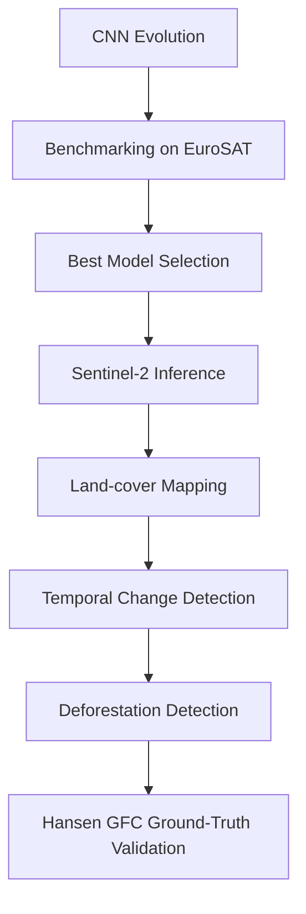

# 🌍 Deforestation Detection using Deep Learning and Sentinel-2 Satellite Imagery

A focused research and engineering project studying the evolution of Convolutional Neural Network (CNN) architectures and applying them to real-world deforestation detection using Sentinel-2 satellite imagery.

---

## 🔍 Project Overview

Deforestation in tropical rainforests like the Amazon is a primary driver of biodiversity loss and carbon emissions. This project provides a complete, self-contained educational research pipeline that starts by implementing classic and modern CNN architectures from scratch, benchmarks them on satellite patch classification, and deploys the best performing model on temporal Sentinel-2 images to detect forest loss in Rondônia, Brazil.

---

## 🎯 Objectives

1. **Study CNN Evolution**: Implement six generations of CNN architectures from scratch in PyTorch (LeNet-5, AlexNet, VGG-16, GoogLeNet, ResNet, and EfficientNet) to understand how deep learning design principles have evolved.
2. **Fair Benchmarking**: Train and compare all architectures under identical training configurations on the EuroSAT dataset.
3. **Model Selection**: Select the optimal architecture based on a trade-off between validation accuracy and inference throughput (latency per image).
4. **Sentinel-2 Inference**: Deploy the selected model to classify land cover on large, multi-temporal Sentinel-2 imagery.
5. **Change & Deforestation Mapping**: Perform temporal change detection to isolate Forest-to-Non-Forest transitions and map deforestation.
6. **Validation**: Automatically validate the model's detected deforestation against publicly available Hansen Global Forest Change (GFW) dataset evidence.

---

## 📊 Dataset

* **Name**: EuroSAT (RGB)
* **Classes**: 10 classes (`AnnualCrop`, `Forest`, `HerbaceousVegetation`, `Highway`, `Industrial`, `Pasture`, `PermanentCrop`, `Residential`, `River`, `SeaLake`)
* **Spectral Bands**: RGB (Red, Green, Blue bands rescaled from Sentinel-2 L2A)
* **Size**: 27,000 images, each 64×64 pixels (10m spatial resolution)

---

## 🧬 CNN Evolution

This repository traces the progression of computer vision research through the following custom PyTorch implementations:

* **LeNet-5 (1998)**: The pioneer of convolutional neural networks utilizing average pooling and tanh activations.
* **AlexNet (2012)**: Scaled depth, introduced ReLU activations, dropout regularization, and max pooling.
* **VGG-16 (2014)**: Standardized design using stacks of small $3 \times 3$ convolutions and deep architectures.
* **GoogLeNet (2014)**: Introduced multi-scale Inception modules utilizing parallel convolutions and $1 \times 1$ bottleneck layers.
* **ResNet-18 / ResNet-50 (2015)**: Introduced residual skip connections to overcome the vanishing gradient problem in deep networks.
* **EfficientNet-B0 (2019)**: Optimized scale using Compound Scaling, balancing depth, width, and resolution.

---

## 🔄 Workflow



---

## 📂 Repository Structure

```text
.
├── src/
│   ├── dataset.py            # EuroSAT dataset and dataloader creation
│   ├── preprocessing.py      # Data transforms and augmentations
│   ├── models/               # Custom PyTorch CNN models from scratch
│   │   ├── __init__.py       # Simple factory module (create_model)
│   │   ├── common.py         # BaseCNN module with weight saving/loading
│   │   ├── lenet.py          # LeNet-5 architecture
│   │   ├── alexnet.py        # AlexNet architecture
│   │   ├── vgg.py            # VGG-16 architecture
│   │   ├── googlenet.py      # GoogLeNet architecture
│   │   ├── resnet.py         # ResNet-18 / ResNet-50 architectures
│   │   └── efficientnet.py   # EfficientNet-B0 architecture
│   ├── training.py           # Clean training loop and trainer class
│   ├── evaluation.py         # Evaluation loops and throughput metrics
│   ├── inference.py          # Patch generator and mapper
│   ├── change_detection.py   # Transition maps, deforestation masking, and validation
│   └── utils.py              # Plotting, confusion matrices, and report generation
├── notebooks/                # Self-contained educational Jupyter Notebooks
├── tests/                    # Automated unit tests
├── download_region.py        # Google Earth Engine data downloader
├── run_demo.py               # Reproducible end-to-end demo execution pipeline
├── train.py                  # CLI training interface
├── evaluate.py               # CLI evaluation and latency benchmarking interface
├── requirements.txt          # Python package requirements
└── README.md                 # Project landing page
```

---

## ⚙️ Installation

To set up the project environment:

```bash
# Clone the repository
git clone https://github.com/Nishchalam/Deforestation-Detection.git
cd Deforestation-Detection

# Create virtual environment
python3 -m venv .venv
source .venv/bin/activate

# Install dependencies
pip install -r requirements.txt
```

---

## 🏋️ Training

Train any custom model architecture from scratch using the CLI interface:

```bash
# Example: Train ResNet-18 for 20 epochs
python train.py --model resnet18 --epochs 20 --lr 0.001 --batch_size 32 --save_path best_resnet18.pth
```

---

## 🔍 Evaluation

Benchmark trained model checkpoints on the EuroSAT test set to evaluate accuracy, precision, recall, F1-score, and latency (throughput):

```bash
# Example: Evaluate ResNet-18 model checkpoint
python evaluate.py --model resnet18 --checkpoint best_resnet18.pth --batch_size 32
```

---

## 🚀 Inference & Deforestation Detection

The project includes an end-to-end reproducible pipeline to detect forest loss in **Rondônia, Brazil**. 

### 1. Download Temporal Imagery & Validation Mask
Use GEE to download cloud-free Sentinel-2 images for two years (e.g. 2018 and 2022) along with the matching Hansen Global Forest Change ground-truth validation loss mask:

```bash
# Note: Requires ee authentication (will prompt to authenticate if needed)
python download_region.py --year1 2018 --year2 2022 --output_dir data/demo
```

### 2. Run End-to-End Deforestation Mapping & Validation
Run patch prediction, stitch the land cover maps, extract forest transitions, and calculate ground-truth validation statistics:

```bash
python run_demo.py --model resnet18 --checkpoint best_resnet18.pth --year1 2018 --year2 2022 --output_dir reports/demo_results
```

---

## 📊 Results

### Model Benchmark (EuroSAT Test Set)

| Architecture | Parameters | Accuracy (%) | F1-Score | Inference Latency (ms/img) | Throughput (img/sec) |
| :--- | :---: | :---: | :---: | :---: | :---: |
| **LeNet-5** | *[Placeholder]* | *[Placeholder]* | *[Placeholder]* | *[Placeholder]* | *[Placeholder]* |
| **AlexNet** | *[Placeholder]* | *[Placeholder]* | *[Placeholder]* | *[Placeholder]* | *[Placeholder]* |
| **VGG-16** | *[Placeholder]* | *[Placeholder]* | *[Placeholder]* | *[Placeholder]* | *[Placeholder]* |
| **GoogLeNet** | *[Placeholder]* | *[Placeholder]* | *[Placeholder]* | *[Placeholder]* | *[Placeholder]* |
| **ResNet-18** | *[Placeholder]* | *[Placeholder]* | *[Placeholder]* | *[Placeholder]* | *[Placeholder]* |
| **ResNet-50** | *[Placeholder]* | *[Placeholder]* | *[Placeholder]* | *[Placeholder]* | *[Placeholder]* |
| **EfficientNet-B0** | *[Placeholder]* | *[Placeholder]* | *[Placeholder]* | *[Placeholder]* | *[Placeholder]* |

### Deforestation Validation Metrics (Rondônia, Brazil)

* **Intersection over Union (IoU)**: *[Placeholder]*
* **Precision**: *[Placeholder]*
* **Recall**: *[Placeholder]*
* **Net Forest Area Lost (Predicted)**: *[Placeholder]* hectares
* **Net Forest Area Lost (Hansen Ground-Truth)**: *[Placeholder]* hectares

---

## 🔮 Future Work

* **Multispectral Data (L1C / L2A)**: Extend custom models to handle all 13 Sentinel-2 bands rather than just RGB.
* **U-Net / Fully Convolutional Networks**: Transition from patch-based classification to semantic segmentation for pixel-level deforestation mapping.
* **Temporal Models**: Integrate RNNs or Temporal CNNs to utilize continuous time-series data instead of only bi-temporal images.

---

## 📚 References

1. Helber, P., Bischke, B., Dengel, A., & Borth, D. (2019). *EuroSAT: A Novel Dataset and Deep Learning Benchmark for Land Use and Land Cover Classification*. IEEE Journal of Selected Topics in Applied Earth Observations and Remote Sensing.
2. Hansen, M. C., et al. (2013). *High-Resolution Global Maps of 21st-Century Forest Cover Change*. Science.
3. LeCun, Y., Bottou, L., Bengio, Y., & Haffner, P. (1998). *Gradient-based learning applied to document recognition*. Proceedings of the IEEE.
4. He, K., Zhang, X., Ren, S., & Sun, J. (2016). *Deep Residual Learning for Image Recognition*. IEEE CVPR.
