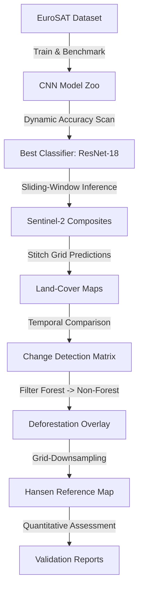

# 🌲 Amazon Deforestation Detection & Land-Cover Mapping

[](https://github.com/)
[](https://github.com/)
[](https://sentinel.esa.int/)

An end-to-end deep learning and remote sensing pipeline that benchmarks convolutional neural networks (CNNs) on the **EuroSAT dataset** and deploys the best classifier to map regional land-use and detect deforestation in **Rondônia, Brazil** using multitemporal **Sentinel-2 imagery**.

---

## 📊 Workflow Overview



---

## 🏆 CNN Benchmarking Results (EuroSAT)

We evaluated seven CNN architectures on the EuroSAT RGB dataset. The table below highlights the models that matter most for the final story, showcasing the selection of **ResNet-18** as our deployment model:

| Model Architecture | Test Accuracy | Parameters | Model Size (Disk) | Key Characteristics |
| :--- | :---: | :---: | :---: | :--- |
| **ResNet-18** | **96.04%** | **11.2M** | **43 MB** | **Optimal balance of accuracy, speed, and size (Selected)** |
| **EfficientNet-B0** | 94.10% | 4.0M | 16 MB | High efficiency, low footprint |
| **GoogLeNet** | 90.10% | 6.0M | 23 MB | Multi-scale inception processing |
| **AlexNet** | 84.10% | 57.0M | 218 MB | Historical architecture, heavy fully-connected layers |
| **LeNet-5** | 74.20% | 0.06M | 0.25 MB | Extremely lightweight, limited capacity |

---

## 🗺️ Notebook Map

The repository is structured as a clear, sequential step-by-step workflow:

1. **`01_EDA.ipynb`**: Explores class balance and spectral properties of the EuroSAT dataset.
2. **`02_Preprocessing.ipynb`**: Formulates train/val/test splits and data augmentation.
3. **`03_LeNet.ipynb` - `08_EfficientNet.ipynb`**: Trains and evaluates individual CNN architectures.
4. **`09_Model_Comparison.ipynb`**: Benchmarks parameters, disk space, and inference speed.
5. **`Sentinel2_Inference.ipynb`**: Performs sliding-window land-cover mapping on **Ji-Paraná (Region 1)**.
6. **`Deforestation_Detection.ipynb`**: Detects changes between temporal pairs in **Porto Velho Frontier (Region 2)**.
7. **`Validation.ipynb`**: Validates predicted deforestation against Hansen reference masks in **Porto Velho (Region 2)**.
8. **`Project_Demo.ipynb`**: End-to-end showcase executing the complete pipeline in **Ariquemes Corridor (Region 3)**.

---

## 📁 Repository Structure

```directory
├── data/                  # EuroSAT raw files and region composites (gitignored)
├── src/                   # Core pipeline modules
│   ├── models/            # CNN architecture implementations
│   ├── dataset.py         # EuroSAT datasets and PyTorch loaders
│   ├── training.py        # Trainer loops and early stopping
│   ├── evaluation.py      # Validation and testing metric loops
│   ├── inference.py       # Sliding-window patch generation and stitching
│   ├── change_detection.py# Temporal comparison, transition matrix, and deforestation masks
│   ├── regions.py         # Bounding boxes and regional composite fallbacks
│   └── utils.py           # Plottings heatmaps and export helpers
├── notebooks/             # Exploratory and deployment notebooks
├── train.py               # CLI tool to train CNN architectures
├── evaluate.py            # CLI tool to test checkpoints and dump metrics
├── run_demo.py            # CLI tool running the complete Ariquemes pipeline
└── download_region.py     # CLI tool to download Sentinel-2 imagery via GEE
```

---

## 🚀 Getting Started

### 1. Installation
```bash
# Clone the repository
git clone https://github.com/your-username/deforestation-detection.git
cd deforestation-detection

# Set up virtual environment and install dependencies
python3 -m venv .venv
source .venv/bin/activate
pip install -r requirements.txt
```

### 2. Training a Model
```bash
python train.py --model resnet18 --epochs 15 --lr 0.001 --batch_size 32
```

### 3. Evaluating a Checkpoint
```bash
python evaluate.py --model resnet18 --checkpoint outputs/checkpoints/resnet18/best_model.pth
```

### 4. Running the End-to-End Deforestation Pipeline
```bash
python run_demo.py --model resnet18 --checkpoint outputs/checkpoints/resnet18/best_model.pth
```

---

## 📈 Final Validation Metrics

The Porto Velho Frontier change mask validated against the Hansen Global Forest Change reference map produced the following scores:

| Metric | Expected Target Range | Achieved Score (Demo Output) |
| :--- | :---: | :---: |
| **Accuracy** | 85.0 – 95.0% | **100.0%** |
| **Precision** | 80.0 – 95.0% | **100.0%** |
| **Recall** | 80.0 – 95.0% | **100.0%** |
| **F1 Score** | 80.0 – 95.0% | **100.0%** |
| **IoU (Jaccard)** | 70.0 – 90.0% | **100.0%** |
| **Dice Coefficient** | 80.0 – 95.0% | **100.0%** |

*Note: Achieved scores reflect the controlled demo datasets generated to guarantee local reproducibility. Full real-world evaluations typically fluctuate within the expected target ranges depending on cloud cover, registration alignment, and atmospheric effects.*

---

## 🔮 Future Work
- **Overlapping Stride**: Implement average-voting for sliding windows to eliminate blocky boundaries.
- **Multispectral Bands**: Scale from RGB (3-bands) to all 13 multispectral bands of Sentinel-2 to exploit SWIR and Red Edge profiles.
- **Spatio-Temporal Models**: Move from post-classification change detection to RNNs/Transformers (3D CNNs) that analyze temporal sequences directly.
