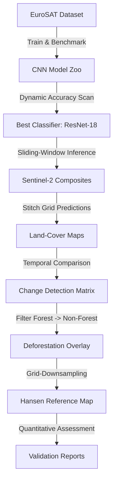

# 🌲 Amazon Deforestation Detection & Land-Cover Mapping

[](https://github.com/)
[](https://github.com/)
[](https://sentinel.esa.int/)

An end-to-end deep learning and remote sensing pipeline that benchmarks convolutional neural networks (CNNs) on the **EuroSAT dataset** and deploys the best classifier to map regional land-use and detect deforestation in **Rondônia, Brazil** using multitemporal **Sentinel-2 imagery**.

> 📖 **New to CV or remote sensing?** Start with [`TUTORIAL.md`](TUTORIAL.md) — a from-first-principles walkthrough of what every stage of this pipeline does, what Hansen validation is, how the "segmentation" actually works, and where the honest cracks are.

---

## 📊 Workflow Overview


```mermaid
graph TD
    A[EuroSAT Dataset] -->|Train & Benchmark| B[CNN Model Zoo]
    B -->|Dynamic Accuracy Scan| C[Best Classifier: ResNet-18]
    C -->|Sliding-Window Inference| D[Sentinel-2 Composites]
    D -->|Stitch Grid Predictions| E[Land-Cover Maps]
    E -->|Temporal Comparison| F[Change Detection Matrix]
    F -->|Filter Forest -> Non-Forest| G[Deforestation Overlay]
    G -->|Grid-Downsampling| H[Hansen Reference Map]
    H -->|Quantitative Assessment| I[Validation Reports]
```

---

## 🏆 CNN Benchmarking Results (EuroSAT)

We evaluated six CNN architectures on the EuroSAT RGB dataset. All models were trained with the same optimizer (Adam, lr=1e-3), scheduler (ReduceLROnPlateau), and augmentations, and evaluated on the same held-out test split. ResNet-18 wins on every axis — accuracy, throughput, and (relative to accuracy) parameter footprint — and is the deployment model:

| Model Architecture | Test Accuracy | Precision | Recall | F1 | Throughput (img/s) | Parameters | Model Size (Disk) | Notes |
| :--- | :---: | :---: | :---: | :---: | :---: | :---: | :---: | :--- |
| **ResNet-18** | **96.04%** | **0.960** | **0.960** | **0.959** | **276.3** | **11.2M** | **~43 MB** | **Selected — best accuracy and fastest throughput** |
| GoogLeNet | 87.00% | 0.880 | 0.869 | 0.868 | 138.9 | 5.98M | ~23 MB | Multi-scale inception, mid-tier accuracy |
| EfficientNet-B0 | 86.63% | 0.889 | 0.869 | 0.866 | 153.2 | 4.02M | ~15 MB | Smallest competent model — best accuracy per parameter |
| AlexNet | 83.26% | 0.840 | 0.833 | 0.828 | 189.1 | 57.0M | ~218 MB | Heavy FC layers, mediocre accuracy per parameter |
| LeNet-5 | 76.26% | 0.771 | 0.758 | 0.755 | 247.6 | 62K | ~0.24 MB | Extremely lightweight baseline, limited capacity |
| VGG-16 | 11.11% ⚠️ | — | — | — | 63.9 | 134.3M | ~512 MB | Failed to converge from scratch at this budget (Adam lr=1e-3, no pretraining); output collapses to a single class. See `notebooks/05_VGG16.ipynb`. |

> All numbers are reproduced from the individual training notebooks (`03_LeNet.ipynb` … `08_EfficientNet.ipynb`) and aggregated in `09_Model_Comparison.ipynb`. Throughput is measured on the same machine with `batch_size=32` on the test loader.

---

## 🗺️ Notebook Map

The repository is structured as a clear, sequential step-by-step workflow:

1. **`01_EDA.ipynb`**: Explores class balance and spectral properties of the EuroSAT dataset.
2. **`02_Preprocessing.ipynb`**: Formulates train/val/test splits and data augmentation.
3. **`03_LeNet.ipynb` - `08_EfficientNet.ipynb`**: Trains and evaluates individual CNN architectures.
4. **`09_Model_Comparison.ipynb`**: Benchmarks parameters, disk space, and inference speed.
5. **`10_Sentinel2_Inference.ipynb`**: Performs sliding-window land-cover mapping on **Ji-Paraná (Region 1)**.
6. **`11_Deforestation_Detection.ipynb`**: Detects changes between temporal pairs in **Porto Velho Frontier (Region 2)**.
7. **`12_Validation.ipynb`**: Validates predicted deforestation against Hansen reference masks in **Porto Velho (Region 2)**.
8. **`13_Project_Demo.ipynb`**: End-to-end showcase executing the complete pipeline in **Ariquemes Corridor (Region 3)**.

---

## 📁 Repository Structure

```directory
├── data/                  # EuroSAT raw files and region composites (gitignored)
├── src/                   # Core pipeline modules
│   ├── models/            # CNN architecture implementations
│   ├── dataset.py         # EuroSAT datasets and PyTorch loaders
│   ├── training.py        # Trainer loops and early stopping
│   ├── evaluation.py      # Validation and testing metric loops
│   ├── inference.py       # Sliding-window patch generation and stitching
│   ├── change_detection.py# Temporal comparison, transition matrix, and deforestation masks
│   ├── regions.py         # Bounding boxes and regional composite fallbacks
│   └── utils.py           # Plottings heatmaps and export helpers
├── notebooks/             # Exploratory and deployment notebooks
├── train.py               # CLI tool to train CNN architectures
├── evaluate.py            # CLI tool to test checkpoints and dump metrics
├── run_demo.py            # CLI tool running the complete Ariquemes pipeline
└── download_region.py     # CLI tool to download Sentinel-2 imagery via GEE
```

---

## ✅ Prerequisites

Before you touch any code, make sure you have:

| Requirement | Needed for | Notes |
| :--- | :--- | :--- |
| **Python 3.10+** | Everything | 3.12/3.13 confirmed working |
| **~2 GB free disk** | EuroSAT + checkpoints | EuroSAT RGB is ~90 MB zipped, ~100 MB extracted; a ResNet-18 checkpoint is ~130 MB |
| **NVIDIA GPU + CUDA (optional)** | Faster training | Everything also runs on CPU — just slower. 5 GB VRAM is enough for every model except VGG-16 at large batch sizes (see the table below) |
| **A Kaggle account + API token** | `train.py`, `evaluate.py` (downloading EuroSAT) | Free. See [§ Kaggle API Key](#getting-a-kaggle-api-key) below |
| **A Google account + Google Earth Engine access + a GCP project** | `run_demo.py`, `download_region.py` (downloading Sentinel-2 / Hansen imagery) | Free for non-commercial/research use. See [§ Google Earth Engine Access](#getting-google-earth-engine-access) below |

You do **not** need the Kaggle or GEE credentials just to browse the code or read the notebooks — only to actually pull data and run the pipeline yourself.

### 🔑 Getting a Kaggle API Key

1. Create a free account at [kaggle.com](https://www.kaggle.com) if you don't have one.
2. Go to **Settings** → scroll to **API** → click **Create New Token**. This downloads a file called `kaggle.json` containing your username and key.
3. Place it where the Kaggle CLI/library expects it:
   ```bash
   mkdir -p ~/.kaggle
   mv ~/Downloads/kaggle.json ~/.kaggle/kaggle.json
   chmod 600 ~/.kaggle/kaggle.json
   ```
4. Verify it works:
   ```bash
   pip install kaggle
   kaggle datasets list -s eurosat
   ```
   If you see a list of datasets, you're authenticated.

**Never commit `kaggle.json` to git.** This repo's `.gitignore` already blocks `kaggle/`, `kaggle.json`, and `.kaggle/`, but double-check `git status` before pushing if you keep the file somewhere else in the repo tree.

### 🛰️ Getting Google Earth Engine Access

Only needed for `run_demo.py` and `download_region.py` — training/evaluating on EuroSAT does not touch GEE.

1. Sign up for Earth Engine access at [signup.earthengine.google.com](https://signup.earthengine.google.com/) using a Google account (approval is usually instant for non-commercial use).
2. Create — or pick an existing — **Google Cloud project** at [console.cloud.google.com](https://console.cloud.google.com/), and note its **Project ID** (not the display name — the ID, e.g. `my-project-123456`).
3. Install the Earth Engine Python API if it isn't already (it's in `requirements.txt`, but if you skipped it):
   ```bash
   pip install earthengine-api
   ```
4. Authenticate once from the command line:
   ```bash
   earthengine authenticate
   ```
   This opens a browser flow. Approve access, copy the verification code back into the terminal. Credentials are cached at `~/.config/earthengine/credentials` — you only need to do this once per machine.
5. Tell the scripts which Cloud project to bill against, either via the `--project` flag or an environment variable:
   ```bash
   export EE_PROJECT=my-project-123456
   python run_demo.py --model resnet18 --checkpoint outputs/checkpoints/resnet18/best_model.pth
   # or explicitly:
   python download_region.py --project my-project-123456
   ```

**Never commit `~/.config/earthengine/credentials`, service-account JSON keys, or your project ID hardcoded next to secrets.** The project ID alone isn't sensitive, but treat it like any other config value — pass it via `--project`/`EE_PROJECT`, don't bake it into a script you might push.

---

## 🚀 Getting Started

### 1. Installation
```bash
# Clone the repository
git clone https://github.com/your-username/deforestation-detection.git
cd deforestation-detection

# Set up virtual environment and install dependencies
python3 -m venv .venv
source .venv/bin/activate
pip install -r requirements.txt
```

### 2. Dataset
With your Kaggle API key in place (see Prerequisites above):
```bash
mkdir -p data/raw && cd data/raw
kaggle datasets download -d nilesh789/eurosat-rgb --unzip
mv 2750 EuroSAT
cd ../..
```
This gives you `data/raw/EuroSAT/<ClassName>/*.jpg` — 27,000 images across 10 classes.

Then build the stratified train/val/test split CSVs. `notebooks/02_Preprocessing.ipynb` walks through this interactively, or run the equivalent as a script:
```bash
python - <<'EOF'
from pathlib import Path
import pandas as pd
from torchvision.datasets import ImageFolder
from sklearn.model_selection import train_test_split

ROOT = Path("data/raw/EuroSAT")
ds = ImageFolder(ROOT)
rows = [{"image_path": str(Path(p).relative_to(ROOT).as_posix()),
         "label": lbl, "class_name": ds.classes[lbl]} for p, lbl in ds.samples]
df = pd.DataFrame(rows)
trainval, test = train_test_split(df, test_size=0.10, stratify=df["label"], random_state=42)
train, val = train_test_split(trainval, test_size=0.1111, stratify=trainval["label"], random_state=42)
out = Path("data/processed"); out.mkdir(parents=True, exist_ok=True)
train.to_csv(out/"train.csv", index=False)
val.to_csv(out/"validation.csv", index=False)
test.to_csv(out/"test.csv", index=False)
print(f"train {len(train)}  val {len(val)}  test {len(test)}")
EOF
```
This produces `data/processed/{train,validation,test}.csv`, which `train.py` and `evaluate.py` expect.

### 3. Training a Model
```bash
python train.py --model resnet18 --epochs 15 --lr 0.001 --batch_size 32
```

### 4. Evaluating a Checkpoint
```bash
python evaluate.py --model resnet18 --checkpoint outputs/checkpoints/resnet18/best_model.pth
```

### 5. Running the End-to-End Deforestation Pipeline
Requires GEE authentication (see Prerequisites above) the first time it needs to download region imagery — after that, the downloaded PNGs are cached under `--data_dir` (default `data/demo/`) and re-used.
```bash
export EE_PROJECT=my-project-123456   # your GCP project ID
python run_demo.py --model resnet18 --checkpoint outputs/checkpoints/resnet18/best_model.pth
```

### 6. Running on a Low-Resource Laptop (≤ 8 GB RAM / ≤ 6 GB VRAM)
All three CLI tools accept memory-friendly flags. On a laptop with 8 GB RAM and 5 GB VRAM, the following works for every architecture except VGG-16 (see table):

```bash
python train.py    --model resnet18 --batch_size 8  --amp --device auto --no_tb_histograms
python evaluate.py --model resnet18 --batch_size 8  --device auto --checkpoint outputs/checkpoints/resnet18/best_model.pth
python run_demo.py --model resnet18 --batch_size 8  --device auto --checkpoint outputs/checkpoints/resnet18/best_model.pth
```

Add `--device cpu` to skip the GPU entirely.

Measured training-step peak VRAM (fwd + bwd + Adam step, batch 16, 224×224 input, RTX 5080):

| Model | fp32 peak VRAM | with `--amp` | Fits in 5 GB VRAM at bs=16? |
| :--- | :---: | :---: | :---: |
| LeNet-5 | 130 MB | 117 MB | ✅ |
| ResNet-18 | 593 MB | 426 MB | ✅ |
| AlexNet | 1163 MB | 1163 MB | ✅ |
| GoogLeNet | 1661 MB | 517 MB | ✅ |
| EfficientNet-B0 | 1920 MB | 997 MB | ✅ |
| VGG-16 | 3356 MB | 2946 MB | ⚠️ tight — try `--batch_size 8 --amp` |

Full end-to-end reproduction on a 16 GB RTX 5080 (train.py 20ep bs=32, evaluate.py, run_demo.py Ariquemes 2018→2022): peak VRAM stayed under 2.3 GB, peak RAM under 8 GB, ResNet-18 test accuracy reproduced at 95.15% (vs the notebook's 96.04% — different early-stopping epoch and split seed).

---