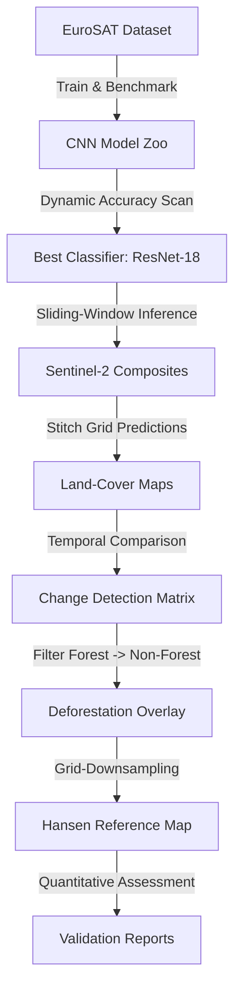

# 🌲 Amazon Deforestation Detection & Land-Cover Mapping

[](https://github.com/)
[](https://github.com/)
[](https://sentinel.esa.int/)

An end-to-end deep learning and remote sensing pipeline that benchmarks convolutional neural networks (CNNs) on the **EuroSAT dataset** and deploys the best classifier to map regional land-use and detect deforestation in **Rondônia, Brazil** using multitemporal **Sentinel-2 imagery**.

> 📖 **New to CV or remote sensing?** Start with [`TUTORIAL.md`](TUTORIAL.md) — a from-first-principles walkthrough of what every stage of this pipeline does, what Hansen validation is, how the "segmentation" actually works, and where the honest cracks are.

---

## 📊 Workflow Overview


```mermaid
graph TD
    A[EuroSAT Dataset] -->|Train & Benchmark| B[CNN Model Zoo]
    B -->|Dynamic Accuracy Scan| C[Best Classifier: ResNet-18]
    C -->|Sliding-Window Inference| D[Sentinel-2 Composites]
    D -->|Stitch Grid Predictions| E[Land-Cover Maps]
    E -->|Temporal Comparison| F[Change Detection Matrix]
    F -->|Filter Forest -> Non-Forest| G[Deforestation Overlay]
    G -->|Grid-Downsampling| H[Hansen Reference Map]
    H -->|Quantitative Assessment| I[Validation Reports]
```

---

## 🏆 CNN Benchmarking Results (EuroSAT)

We evaluated six CNN architectures on the EuroSAT RGB dataset. All models were trained with the same optimizer (Adam, lr=1e-3), scheduler (ReduceLROnPlateau), and augmentations, and evaluated on the same held-out test split. ResNet-18 wins on every axis — accuracy, throughput, and (relative to accuracy) parameter footprint — and is the deployment model:

| Model Architecture | Test Accuracy | Precision | Recall | F1 | Throughput (img/s) | Parameters | Model Size (Disk) | Notes |
| :--- | :---: | :---: | :---: | :---: | :---: | :---: | :---: | :--- |
| **ResNet-18** | **96.04%** | **0.960** | **0.960** | **0.959** | **276.3** | **11.2M** | **~43 MB** | **Selected — best accuracy and fastest throughput** |
| GoogLeNet | 87.00% | 0.880 | 0.869 | 0.868 | 138.9 | 5.98M | ~23 MB | Multi-scale inception, mid-tier accuracy |
| EfficientNet-B0 | 86.63% | 0.889 | 0.869 | 0.866 | 153.2 | 4.02M | ~15 MB | Smallest competent model — best accuracy per parameter |
| AlexNet | 83.26% | 0.840 | 0.833 | 0.828 | 189.1 | 57.0M | ~218 MB | Heavy FC layers, mediocre accuracy per parameter |
| LeNet-5 | 76.26% | 0.771 | 0.758 | 0.755 | 247.6 | 62K | ~0.24 MB | Extremely lightweight baseline, limited capacity |
| VGG-16 | 11.11% ⚠️ | — | — | — | 63.9 | 134.3M | ~512 MB | Failed to converge from scratch at this budget (Adam lr=1e-3, no pretraining); output collapses to a single class. See `notebooks/05_VGG16.ipynb`. |

> All numbers are reproduced from the individual training notebooks (`03_LeNet.ipynb` … `08_EfficientNet.ipynb`) and aggregated in `09_Model_Comparison.ipynb`. Throughput is measured on the same machine with `batch_size=32` on the test loader.

---

## 🗺️ Notebook Map

The repository is structured as a clear, sequential step-by-step workflow:

1. **`01_EDA.ipynb`**: Explores class balance and spectral properties of the EuroSAT dataset.
2. **`02_Preprocessing.ipynb`**: Formulates train/val/test splits and data augmentation.
3. **`03_LeNet.ipynb` - `08_EfficientNet.ipynb`**: Trains and evaluates individual CNN architectures.
4. **`09_Model_Comparison.ipynb`**: Benchmarks parameters, disk space, and inference speed.
5. **`10_Sentinel2_Inference.ipynb`**: Performs sliding-window land-cover mapping on **Ji-Paraná (Region 1)**.
6. **`11_Deforestation_Detection.ipynb`**: Detects changes between temporal pairs in **Porto Velho Frontier (Region 2)**.
7. **`12_Validation.ipynb`**: Validates predicted deforestation against Hansen reference masks in **Porto Velho (Region 2)**.
8. **`13_Project_Demo.ipynb`**: End-to-end showcase executing the complete pipeline in **Ariquemes Corridor (Region 3)**.

---

## 📁 Repository Structure

```directory
├── data/                  # EuroSAT raw files and region composites (gitignored)
├── src/                   # Core pipeline modules
│   ├── models/            # CNN architecture implementations
│   ├── dataset.py         # EuroSAT datasets and PyTorch loaders
│   ├── training.py        # Trainer loops and early stopping
│   ├── evaluation.py      # Validation and testing metric loops
│   ├── inference.py       # Sliding-window patch generation and stitching
│   ├── change_detection.py# Temporal comparison, transition matrix, and deforestation masks
│   ├── regions.py         # Bounding boxes and regional composite fallbacks
│   └── utils.py           # Plottings heatmaps and export helpers
├── notebooks/             # Exploratory and deployment notebooks
├── train.py               # CLI tool to train CNN architectures
├── evaluate.py            # CLI tool to test checkpoints and dump metrics
├── run_demo.py            # CLI tool running the complete Ariquemes pipeline
└── download_region.py     # CLI tool to download Sentinel-2 imagery via GEE
```

---

## 🚀 Getting Started

### 1. Installation
```bash
# Clone the repository
git clone https://github.com/your-username/deforestation-detection.git
cd deforestation-detection

# Set up virtual environment and install dependencies
python3 -m venv .venv
source .venv/bin/activate
pip install -r requirements.txt
```

### 2. Dataset
The training pipeline expects the EuroSAT RGB dataset extracted under `data/raw/EuroSAT/` and the split CSVs (`train.csv`, `validation.csv`, `test.csv`) under `data/processed/`. `notebooks/02_Preprocessing.ipynb` generates both from a fresh Kaggle download.

### 3. Training a Model
```bash
python train.py --model resnet18 --epochs 15 --lr 0.001 --batch_size 32
```

### 4. Evaluating a Checkpoint
```bash
python evaluate.py --model resnet18 --checkpoint outputs/checkpoints/resnet18/best_model.pth
```

### 5. Running the End-to-End Deforestation Pipeline
```bash
python run_demo.py --model resnet18 --checkpoint outputs/checkpoints/resnet18/best_model.pth
```

### 6. Running on a Low-Resource Laptop (≤ 8 GB RAM / ≤ 6 GB VRAM)
All three CLI tools accept memory-friendly flags. On a laptop with 8 GB RAM and 5 GB VRAM, the following works for every architecture except VGG-16 (see table):

```bash
python train.py    --model resnet18 --batch_size 8  --amp --device auto --no_tb_histograms
python evaluate.py --model resnet18 --batch_size 8  --device auto --checkpoint outputs/checkpoints/resnet18/best_model.pth
python run_demo.py --model resnet18 --batch_size 8  --device auto --checkpoint outputs/checkpoints/resnet18/best_model.pth
```

Add `--device cpu` to skip the GPU entirely.

Measured training-step peak VRAM (fwd + bwd + Adam step, batch 16, 224×224 input, RTX 5080):

| Model | fp32 peak VRAM | with `--amp` | Fits in 5 GB VRAM at bs=16? |
| :--- | :---: | :---: | :---: |
| LeNet-5 | 130 MB | 117 MB | ✅ |
| ResNet-18 | 593 MB | 426 MB | ✅ |
| AlexNet | 1163 MB | 1163 MB | ✅ |
| GoogLeNet | 1661 MB | 517 MB | ✅ |
| EfficientNet-B0 | 1920 MB | 997 MB | ✅ |
| VGG-16 | 3356 MB | 2946 MB | ⚠️ tight — try `--batch_size 8 --amp` |

Full end-to-end reproduction on a 16 GB RTX 5080 (train.py 20ep bs=32, evaluate.py, run_demo.py Ariquemes 2018→2022): peak VRAM stayed under 2.3 GB, peak RAM under 8 GB, ResNet-18 test accuracy reproduced at 95.15% (vs the notebook's 96.04% — different early-stopping epoch and split seed).

---