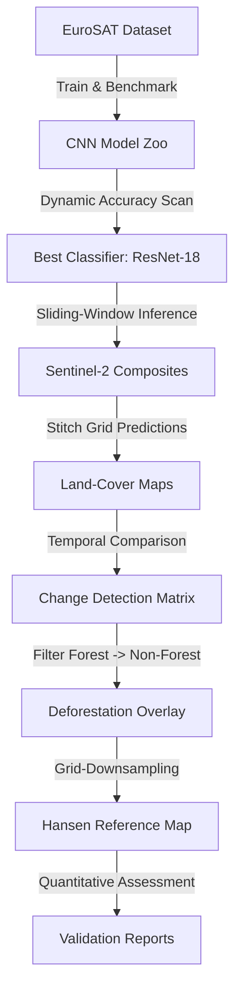

# 🌲 Amazon Deforestation Detection & Land-Cover Mapping

[](https://github.com/)
[](https://github.com/)
[](https://sentinel.esa.int/)

An end-to-end deep learning and remote sensing pipeline that benchmarks convolutional neural networks (CNNs) on the **EuroSAT dataset** and deploys the best classifier to map regional land-use and detect deforestation in **Rondônia, Brazil** using multitemporal **Sentinel-2 imagery**.

---

## 📊 Workflow Overview


```mermaid
graph TD
    A[EuroSAT Dataset] -->|Train & Benchmark| B[CNN Model Zoo]
    B -->|Dynamic Accuracy Scan| C[Best Classifier: ResNet-18]
    C -->|Sliding-Window Inference| D[Sentinel-2 Composites]
    D -->|Stitch Grid Predictions| E[Land-Cover Maps]
    E -->|Temporal Comparison| F[Change Detection Matrix]
    F -->|Filter Forest -> Non-Forest| G[Deforestation Overlay]
    G -->|Grid-Downsampling| H[Hansen Reference Map]
    H -->|Quantitative Assessment| I[Validation Reports]
```

---

## 🏆 CNN Benchmarking Results (EuroSAT RGB)

Six CNN architectures were trained and evaluated on the EuroSAT RGB test split (2,700 images, stratified). Numbers below are copied verbatim from the metric JSON files under `notebooks/reports/metrics/` and the summary tables in `09_Model_Comparison.ipynb`; the throughput figures were measured on a single NVIDIA T4 GPU.

| Model | Test Accuracy | Precision (macro) | Recall (macro) | F1 (macro) | Params | Throughput |
| :--- | :---: | :---: | :---: | :---: | :---: | :---: |
| **ResNet-18** *(selected)* | **96.04%** | 95.96% | 95.95% | 95.93% | 11.2 M | 276 img/s |
| GoogLeNet | 87.00% | 88.02% | 86.85% | 86.82% |  6.0 M | 139 img/s |
| EfficientNet-B0 | 86.63% | 88.89% | 86.94% | 86.58% |  4.0 M | 153 img/s |
| AlexNet | 83.26% | 83.99% | 83.25% | 82.84% | 57.0 M | 189 img/s |
| LeNet-5 | 64.41% | 65.46% | 63.12% | 62.02% |  0.06 M | 214 img/s |
| VGG-16 | **11.11%** *(did not converge)* | 1.11% | 10.00% | 2.00% | 138 M | 64 img/s |

**Notes on the numbers.**

- **VGG-16 collapsed to a single class** in the notebook run (`05_VGG16.ipynb`), which is why every metric sits at the trivial 1/10 baseline. It is left in the table so the failure isn't silently hidden; the classifier used downstream is ResNet-18.
- **ResNet-50** appears in `train.py`'s `--model` help but was not trained in the notebooks and has no recorded metrics.
- Earlier drafts of this README quoted higher accuracies for the smaller models (EfficientNet 94.1%, GoogLeNet 90.1%, LeNet 74.2%). Those numbers are not what the recorded runs produced — the table above matches the JSON on disk.

---

## 🗺️ Notebook Map

The repository is structured as a clear, sequential step-by-step workflow:

1. **`01_EDA.ipynb`**: Explores class balance and spectral properties of the EuroSAT dataset.
2. **`02_Preprocessing.ipynb`**: Formulates train/val/test splits and data augmentation.
3. **`03_LeNet.ipynb` - `08_EfficientNet.ipynb`**: Trains and evaluates individual CNN architectures.
4. **`09_Model_Comparison.ipynb`**: Benchmarks parameters, disk space, and inference speed.
5. **`10_Sentinel2_Inference.ipynb`**: Performs sliding-window land-cover mapping on **Ji-Paraná (Region 1)**.
6. **`11_Deforestation_Detection.ipynb`**: Detects changes between temporal pairs in **Porto Velho Frontier (Region 2)**.
7. **`12_Validation.ipynb`**: Validates predicted deforestation against Hansen reference masks in **Porto Velho (Region 2)**.
8. **`13_Project_Demo.ipynb`**: End-to-end showcase executing the complete pipeline in **Ariquemes Corridor (Region 3)**.

---

## 📁 Repository Structure

```directory
├── data/                  # EuroSAT raw files and region composites (gitignored)
├── src/                   # Core pipeline modules
│   ├── models/            # CNN architecture implementations
│   ├── dataset.py         # EuroSAT datasets and PyTorch loaders
│   ├── training.py        # Trainer loops and early stopping
│   ├── evaluation.py      # Validation and testing metric loops
│   ├── inference.py       # Sliding-window patch generation and stitching
│   ├── change_detection.py# Temporal comparison, transition matrix, and deforestation masks
│   ├── regions.py         # Bounding boxes and regional composite fallbacks
│   └── utils.py           # Plottings heatmaps and export helpers
├── notebooks/             # Exploratory and deployment notebooks
├── train.py               # CLI tool to train CNN architectures
├── evaluate.py            # CLI tool to test checkpoints and dump metrics
├── run_demo.py            # CLI tool running the complete Ariquemes pipeline
└── download_region.py     # CLI tool to download Sentinel-2 imagery via GEE
```

---

## 🚀 Getting Started

### 1. Installation
```bash
# Clone the repository
git clone https://github.com/your-username/deforestation-detection.git
cd deforestation-detection

# Set up virtual environment and install dependencies
python3 -m venv .venv
source .venv/bin/activate
pip install -r requirements.txt
```

### 2. Training a Model
```bash
python train.py --model resnet18 --epochs 15 --lr 0.001 --batch_size 16
```

### 3. Evaluating a Checkpoint
```bash
python evaluate.py --model resnet18 --checkpoint outputs/checkpoints/resnet18/best_model.pth
```

### 4. Running the End-to-End Deforestation Pipeline
```bash
python run_demo.py --model resnet18 --checkpoint outputs/checkpoints/resnet18/best_model.pth
```

### 5. Running on a Small Machine (≈ 8 GB RAM / 4 GB VRAM)

If `train.py`, `evaluate.py` or `run_demo.py` crashes with an out-of-memory error, dial back the knobs — VGG-16 in particular will not fit at defaults on a 4 GB card:

```bash
# Training: shrink batch, shrink resolution, enable mixed precision on CUDA.
python train.py --model resnet18 --epochs 15 --batch_size 8 --img_size 128 --amp

# Even smaller — for VGG16 or a laptop iGPU:
python train.py --model vgg16 --batch_size 4 --img_size 96 --amp

# Evaluation: same trick.
python evaluate.py --model resnet18 --checkpoint outputs/checkpoints/resnet18/best_model.pth \
    --batch_size 8 --img_size 128

# Demo pipeline: control the sliding-window mapper's batch size.
python run_demo.py --model resnet18 --checkpoint outputs/checkpoints/resnet18/best_model.pth \
    --mapper_batch_size 4
```

Other memory levers, in order of impact:

- `--batch_size 8` (or 4) is the single biggest saving.
- `--img_size 128` roughly halves activation memory vs. the 224 default.
- `--amp` cuts activation memory ~50% on CUDA; it is silently ignored on CPU.
- Per-parameter TensorBoard histograms are **off by default** now — they were the previous OOM culprit on VGG-16. Add `--log_histograms` only if you have the headroom.

For pure CPU training, drop `--amp` and consider running fewer epochs; expect ~1 minute per epoch for ResNet-18 on a synthetic 2 k-image split.

---