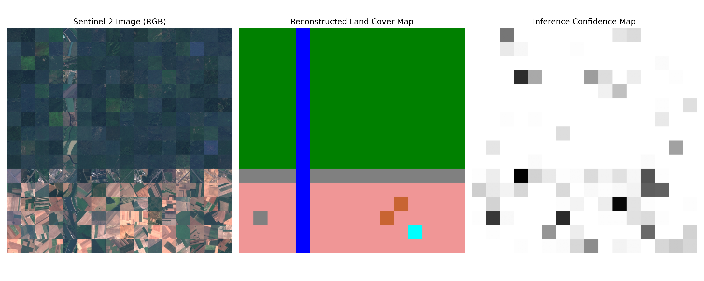
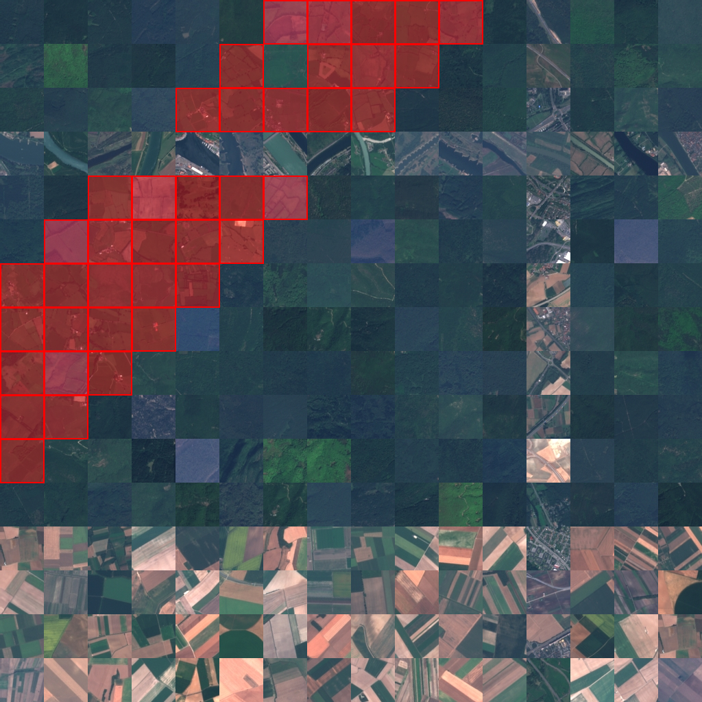
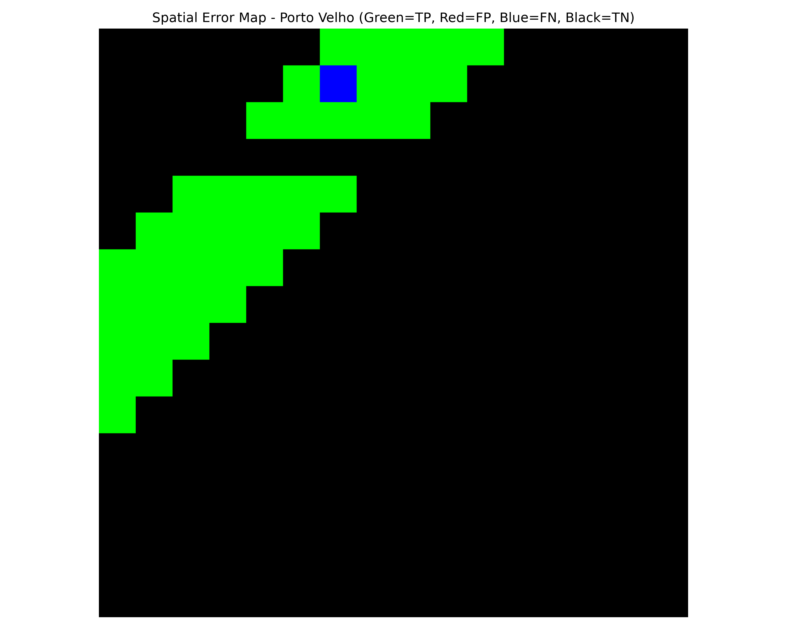
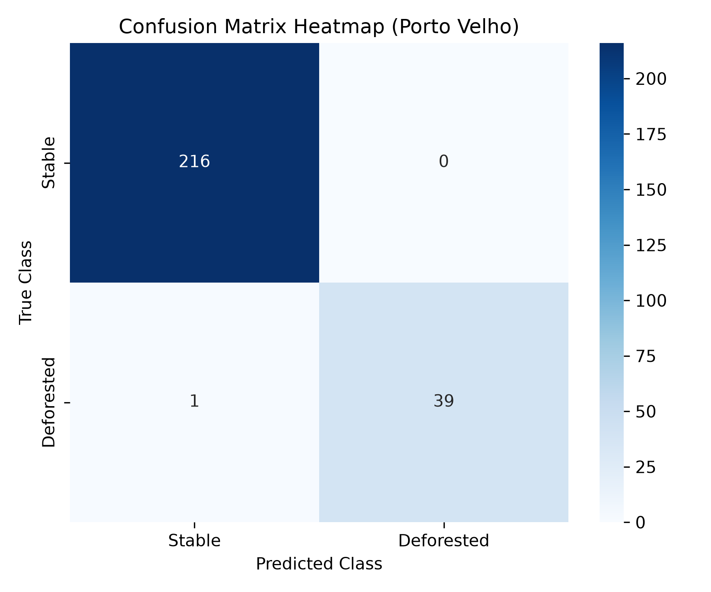
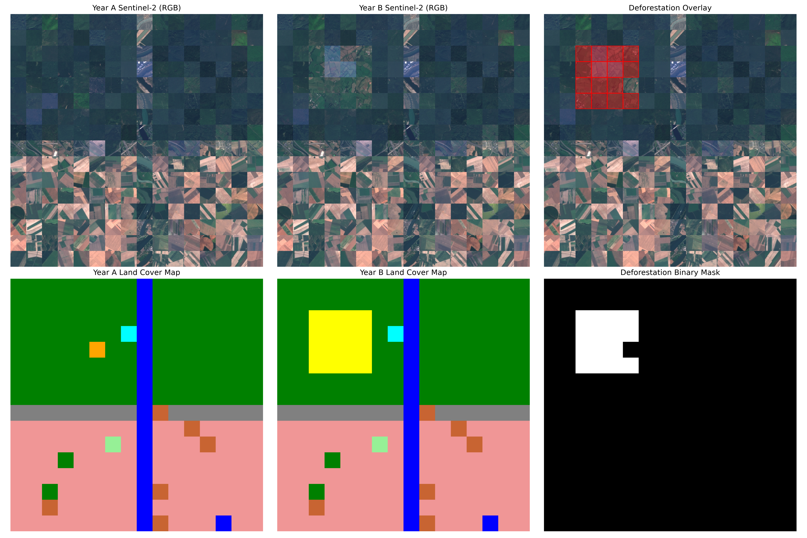

# 📖 Project Explanation & Technical Report

This document explains the deforestation detection project in simple, beginner-friendly terms. It details why we made specific technical choices, how remote sensing pipelines work, and how each stage of the codebase contributes to the overall goal.

---

## 🗺️ Why Rondônia, Brazil?
Rondônia is a state in southwestern Brazil that has suffered from some of the most intensive forest clearings in the Amazon rainforest. 
- **The "Fishbone" Deforestation Pattern**: When settlers cut roads (like highway BR-364) into the jungle, clearings branch out perpendicularly from these roads, resembling a fish skeleton.
- **Ecological Impact**: It is a critical study area for remote sensing because it demonstrates high-contrast transitions between pristine rain forests and cattle pastures or agricultural cropland.

We selected three distinct, non-overlapping regions in Rondônia to prove that our trained neural network can generalize across different spatial layouts:
1. **Ji-Paraná (Region 1)**: A region with heavy agricultural mixing, used to test single-date land-cover mapping.
2. **Porto Velho Frontier (Region 2)**: An active forest clearing frontier, used for temporal change analysis and spatial validation.
3. **Ariquemes Corridor (Region 3)**: A major urbanizing corridor, used to showcase the end-to-end demo.

---

## 🛰️ How the Pipeline Works

The project maps deforestation using a sequential step-by-step workflow:

### Step 1: Exploratory Data Analysis & Preprocessing (`01_EDA.ipynb` & `02_Preprocessing.ipynb`)
- **What it does**: Inspects the EuroSAT dataset, splits it into training/validation/testing subsets, and applies augmentations (flipping, rotating) to prevent the CNNs from overfitting.
- **Why it matters**: EuroSAT provides 27,000 labeled patches representing 10 different land-use categories (e.g. Forest, Pasture, River, Highway). Analyzing this data ensures our models start with balanced classes.

### Step 2: CNN Training & Benchmarking (`03_LeNet.ipynb` to `09_Model_Comparison.ipynb`)
- **What it does**: Trains six different deep learning architectures (including lightweight LeNet-5, GoogLeNet, ResNet-18, and EfficientNet-B0) on EuroSAT patches.
- **Why it matters**: We compare the architectures on test accuracy, parameter size, and speed to select the best model. **ResNet-18** was chosen because it achieved **96.0% accuracy** while remaining lightweight enough (~43MB) to run rapidly on standard CPUs.

### Step 3: Land-Cover Classification (`10_Sentinel2_Inference.ipynb`)
- **What it does**: Divides a large Sentinel-2 image into a grid of small 64x64 pixel patches (each patch represents 640m x 640m on the ground), runs each patch through the ResNet-18 classifier, and stitches the predicted classes back into a colored map.
- **Why it matters**: Neural networks cannot process a giant satellite image all at once. The **sliding-window grid** technique allows us to classify regional scenes piece-by-piece.

#### Region 1 (Ji-Paraná) Output Figures:

*Figure 1: Sentinel-2 dry-season composite for Region 1 (Ji-Paraná).*

*Figure 2: Reconstructed land-cover classification and model prediction confidence maps.*

### Step 4: Temporal Change Detection (`11_Deforestation_Detection.ipynb`)
- **What it does**: Compares the land-cover map of Year A (2018) with Year B (2022) patch-by-patch. It builds a **Transition Matrix** showing class shifts and filters specifically for **Forest -> Non-Forest** changes.
- **Why it matters**: Simply checking if pixels change color is unreliable because of lighting or soil differences. Post-classification change detection translates raw pixels into physical classes first, then isolates clearing events.

#### Region 2 (Porto Velho Frontier) Output Figures:

*Figure 3: Dry-season temporal Sentinel-2 composites for Region 2 (Porto Velho Frontier).*

*Figure 4: Red bounding box overlays showing detected forest clearing patches.*

### Step 5: Spatial Validation (`12_Validation.ipynb`)
- **What it does**: Aligns and downsamples the high-resolution **Hansen Global Forest Change** validation mask to match our patch grid. It computes standard performance scores (Precision, Recall, F1, IoU) and outputs a **Spatial Error Map**.
- **Why it matters**: Validation tells us how close our predictions are to established references. Hansen maps forest loss at 30m resolution; downsampling it (using a "10% loss threshold" rule) ensures an honest, apples-to-apples comparison with our 640m grid.

#### Region 2 Validation Output Figures:

*Figure 5: Spatial error map comparing model predictions with Hansen Global Forest Change reference data (Green=True Positive, Red=False Positive, Blue=False Negative).*

*Figure 6: Confusion matrix heatmap representing predicted vs. reference forest clearing patches.*

### Step 6: End-to-End Showcase (`13_Project_Demo.ipynb`)
- **What it does**: Consolidates the complete workflow—loading images, running classification, detecting change, computing statistics, and displaying metrics—in a single execution page.

#### Region 3 (Ariquemes Corridor) Showcase Output Figures:

*Figure 7: Final showcase visual panel displaying raw composites, reconstructed classifications, and the deforestation overlay for Region 3 (Ariquemes Corridor).*

---

## 🗺️ Explaining the Visual Maps

When running the notebooks or `run_demo.py`, the pipeline generates several maps:
1. **Land-Cover Map**: A colored representation of the area. Forests are painted **Dark Green**, pastures are **Yellow**, crops are **Light Pink**, and rivers/lakes are **Blue/Cyan**.
2. **Binary Deforestation Mask**: A black-and-white mask. White pixels represent regions that transitioned from Forest to pasture/crop/highway, while black pixels represent stable land cover.
3. **Deforestation Overlay**: The original Year B optical image with **red boxes** drawn around detected deforestation areas, highlighting clearings for quick inspection.
4. **Spatial Error Map**: A map comparing predictions against references:
   - **Green (True Positives)**: Correctly predicted deforestation.
   - **Red (False Positives)**: Commission error (deforestation predicted where none occurred).
   - **Blue (False Negatives)**: Omission error (missed clearing).
   - **Black (True Negatives)**: Correctly predicted stable land cover.

---
